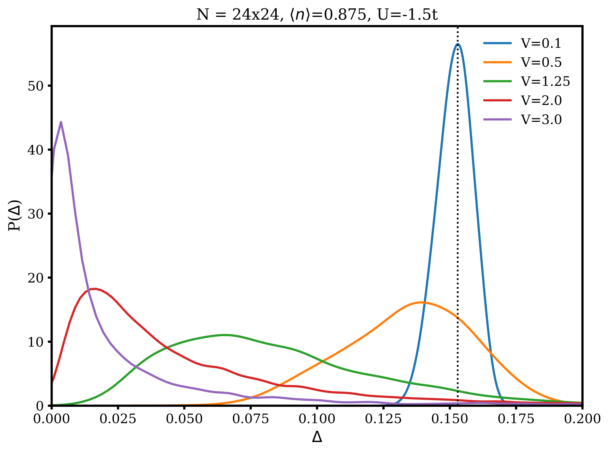
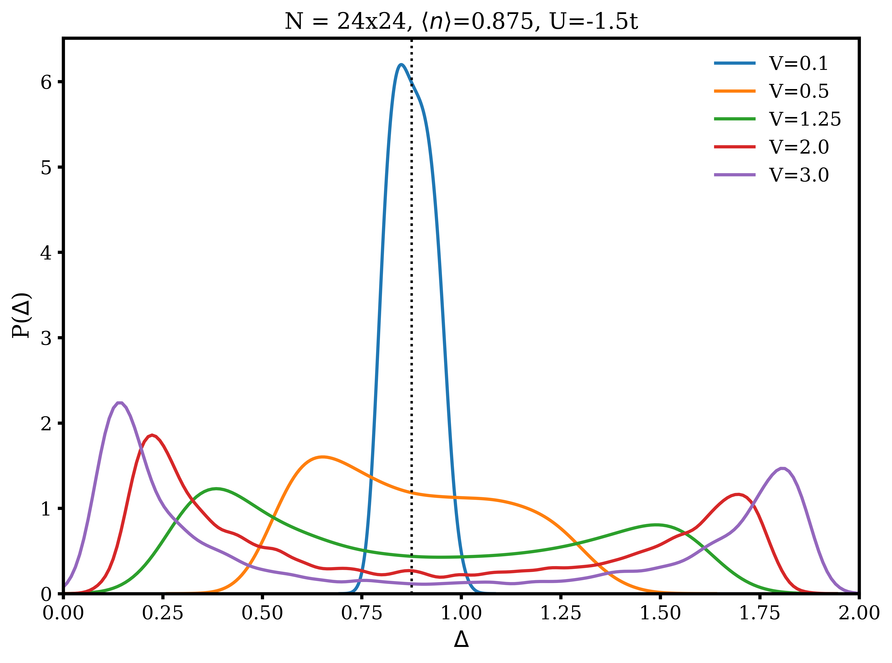
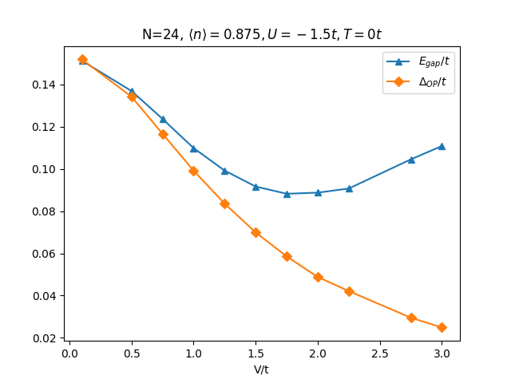
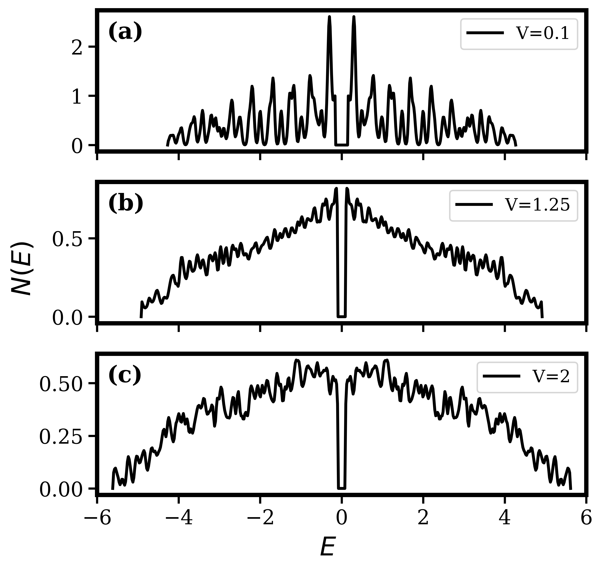

[](https://doi.org/10.5281/zenodo.17360717)

This repository holds the code for the work **"Effect of correlated disorder on superconductivity in a kagome lattice: A Bogoliubov–de Gennes analysis"** published in [Phys. Rev. B 110, 184506](https://doi.org/10.1103/PhysRevB.110.184506) and the full text can also be found on [ResearchGate](https://www.researchgate.net/publication/385637326_Effect_of_correlated_disorder_on_superconductivity_in_a_kagome_lattice_A_Bogoliubov-de_Gennes_analysis)
This is real space implementation and hence some of the serious calculations will be resource intensive. 

The basic structure of the directory for running any BdG calculation is : 
```
├── `data`
├── `logs`
├── `results`
├── `scripts`
└── `src`
```

`data`: This directory is used to store all the important input files needed to run the BdG calculation. For example `df_square12.csv`, `vUncorrelatedDict12.pkl` etc.

`logs`: This directory is used to store log files.

`results`: This directory is used to store results from the BdG calculation.

`scripts`: This is the directory where all the calculation is run. It contains all the script files needed to run any BdG calculation. 


| File Name | Description |
|------------|--------------|
| `bdg_plotting_utils.py` | Plotting utilities (Python) used after completion of BdG calculation. |
| `calckx.py` | Python script to calculate the diamagnetic response (average kinetic energy) in the x direction, $K_x$ (see definition of $K_x$ in Phys. Rev. B 110, 184506). |
| `calclambda.py` | Python script to calculate paramagnetic response, $\Lambda_{xx}$ (see definition $\Lambda_{xx}$ used in the above reference.[^1] |
| `check_julia_dependency.jl` | Check and install Julia dependencies needed to run the calculation (`julia check_julia_dependency.jl`). |
| `check_python_dependency.py` | Check and install Python dependencies needed to run the calculation (`python check_python_dependency.jl`). |
| `create_input_files.jl` | Creates all required input files needed to run the calculation (`julia create_input_files.jl`). |
| `main_corr.jl` | Main Julia script to run BdG calculation for random correlated disorder. |
| `main_make_plots_T.py` | Python script to plot important temperature-dependent quantities after BdG calculation. |
| `main_uncorr.jl` | Main Julia script to run BdG calculation for random uncorrelated disorder. |
| `Makefile` | Makefile for running quick bash commands. `make reset` clears everything except data directory contents to rerun with the same inputs; `make fresh` deletes unnecessary files and runs a fresh calculation. |
| `params.jl` | Parameter file containing model and simulation parameters for the BdG calculation. |
| `plot_params.py` | Parameter file for plotting — defines style, ranges, and labels for visualization scripts. |
| `scrift_info.md` | Markdown file containing a summary of what each script does. |
| `show_status.sh` | Bash script to check the status of ongoing or completed BdG calculations. (`./show_status.sh` shows all; `./show_status.sh -r` shows only running ones.) |
| `stiffness_utils.py` | Utility functions for calculating superfluid stiffness or related response quantities from BdG outputs. |


[^1]: This implementation only calculates the paramagnetic response for the Kagome lattice as discussed in Phys. Rev. B 110, 184506. Please keep in mind that for a sufficiently large lattice size this would be a time-consuming process. It won't give satisfactory results for very small lattice sizes due to finite size effects, however the implementation and working can be checked for smaller lattice sizes.

`src`: This directory contains all the source files needed to run a BdG calculation.


| File Name | Description |
|------------|--------------|
| `bdg_utilities.jl` | All the utilities required for running BdG calculation. |
| `external_utils.jl` | Functions used for specific cases where the Hamiltonian is taken from an external source (e.g., FORTRAN). Usually not required for general calculations. |
| `generalutils.jl` | Contains general utility functions that are useful for BdG calculations and other related tasks. |
| `logging_utils.jl` | Utilities required for logging during BdG calculations and related processes. |


## Workflow 
1. **Step 0 :** Run Makefile for fresh calculation. `make fresh`
2. **Step 1 :** Edit the `params.jl` file accordingly 
3. **Step 2 :** Run `julia create_input_files.jl` to create input files needed to run the BdG calculation. It will create necessary directories and files.
4. **Step 3 :** Run `julia -p <n> script_name.jl` on `n` cores using the script `script_name.jl`

### Some results from the seminal paper by A.Ghosal et al. (Physical Reviw B, Vol. 65, 014501), reproduced using the code as benchmark.

<table>
  <tr>
    <td></td>
    <td></td>
  </tr>
  <tr>
    <td></td>
    <td></td>
  </tr>
</table>
