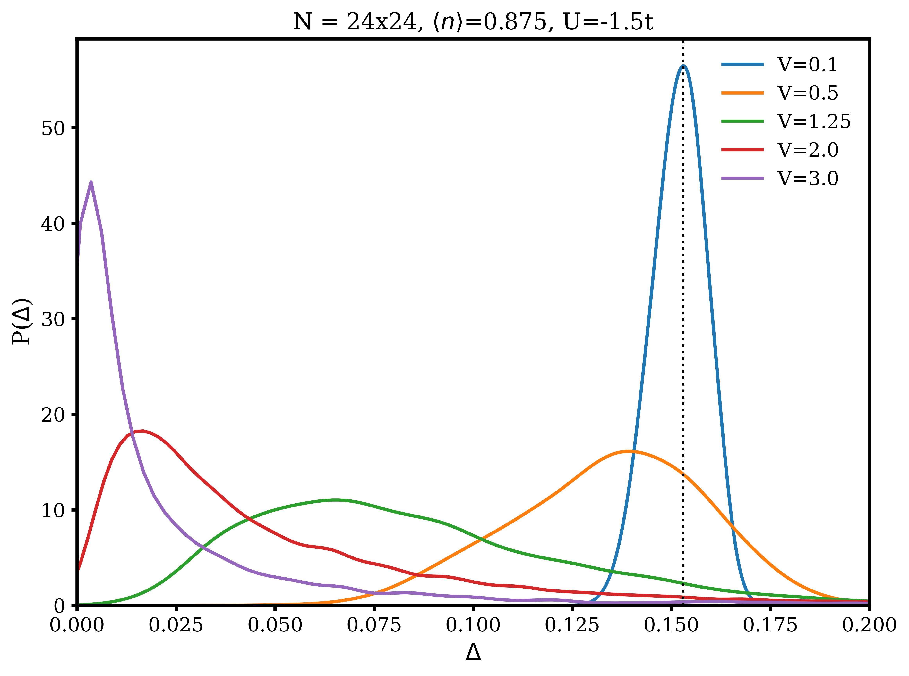
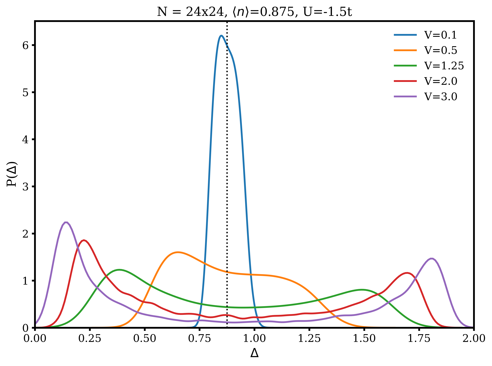
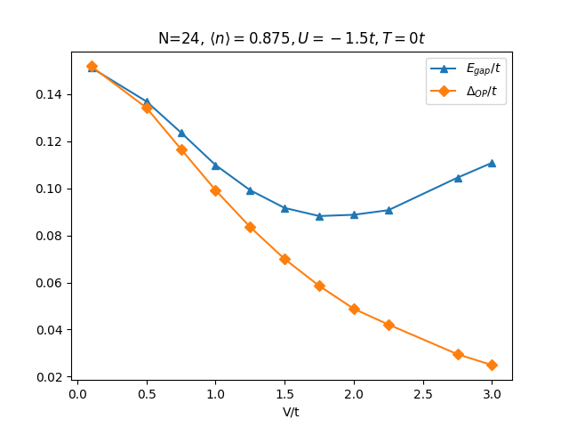
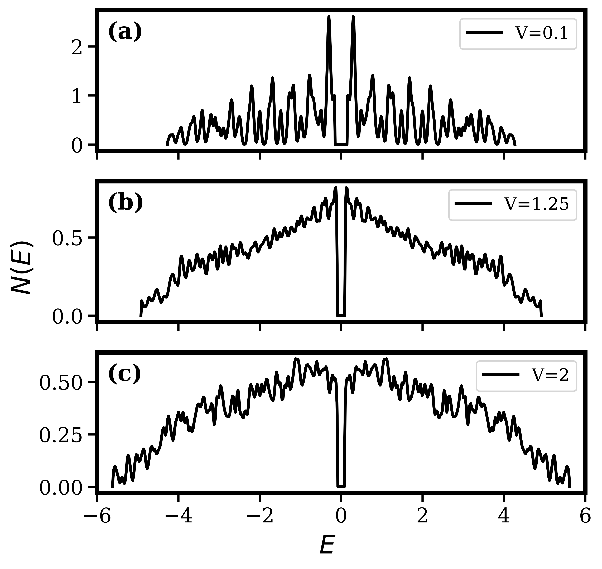

# BdG-Julia

### Some results obtained using the code from the seminal paper by A.Ghosal et al. (PHYSICAL REVIEW B, VOLUME 65, 014501)

<table>
  <tr>
    <td></td>
    <td></td>
  </tr>
  <tr>
    <td></td>
    <td></td>
  </tr>
</table>
